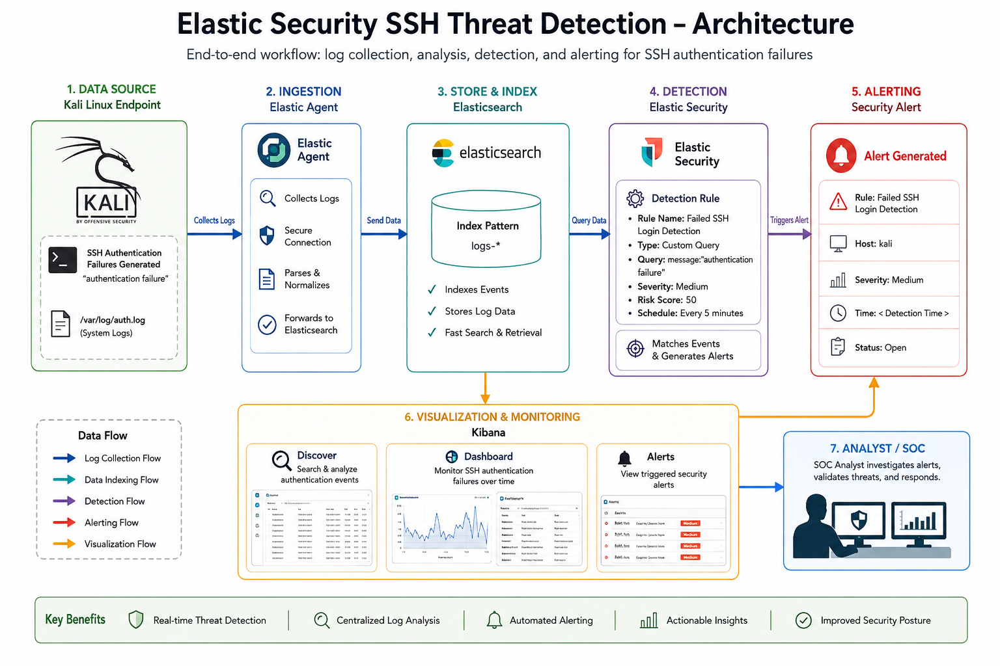
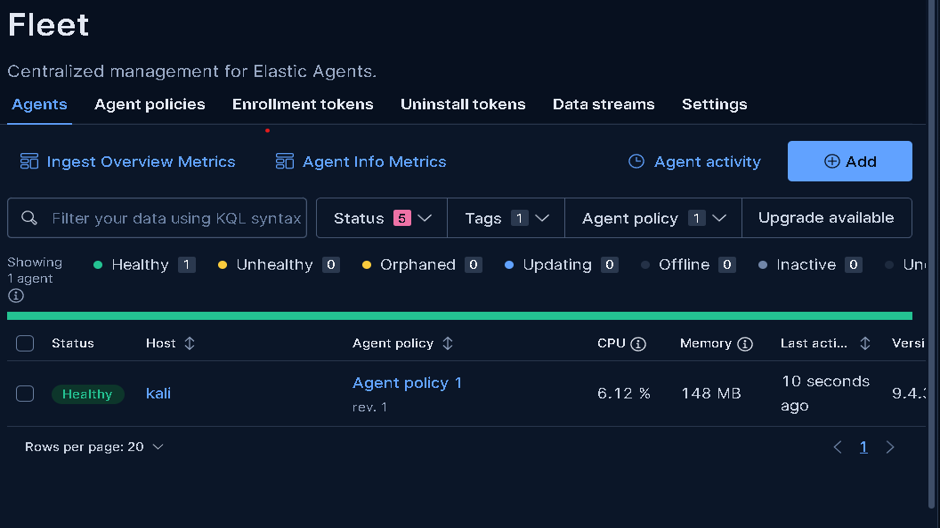
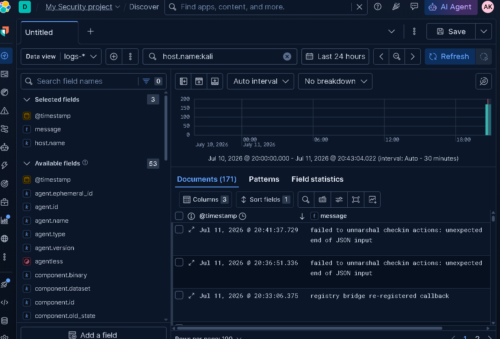
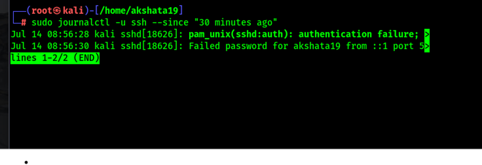
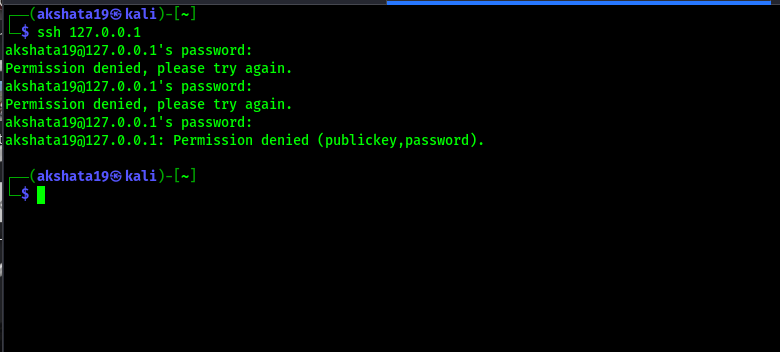
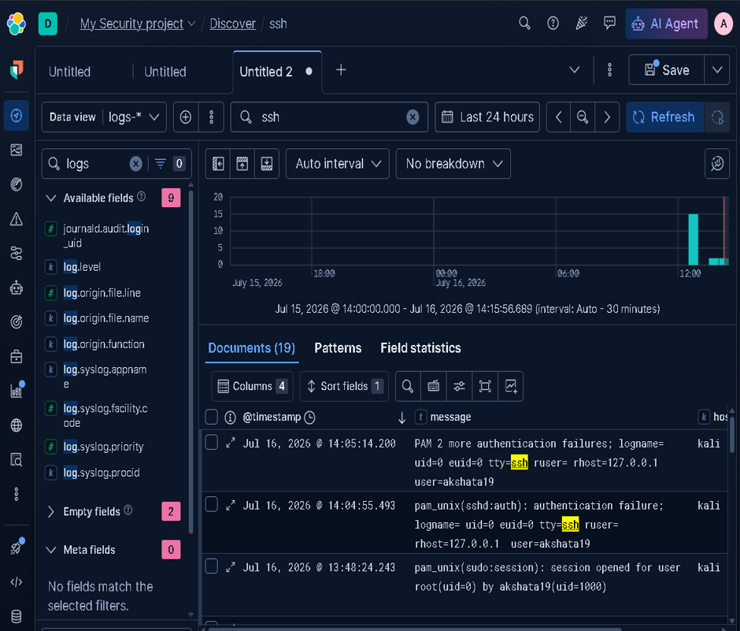
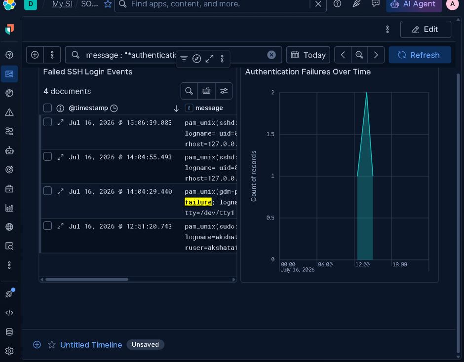
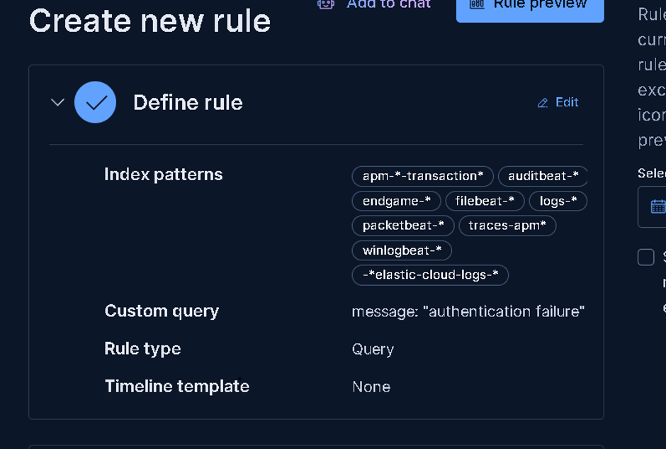
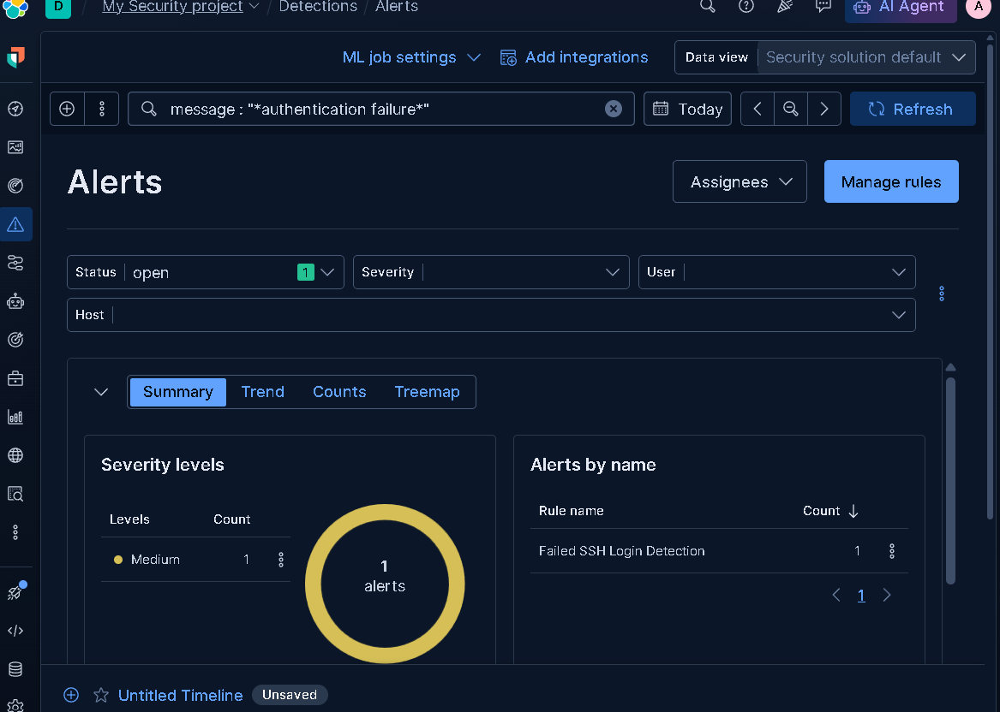

# Elastic Security SSH Threat Detection



## Overview

This project demonstrates the implementation of an Elastic Security home lab for monitoring SSH authentication activity, detecting failed login attempts, and validating security alerts using Elastic Security.

The lab simulates SSH authentication failures on a Kali Linux endpoint monitored by Elastic Agent. Collected logs are indexed into Elasticsearch, analyzed through Kibana, matched against a custom detection rule, and investigated using Elastic Security.

---

# Project Highlights

- 🚀 Configured Elastic Agent for endpoint telemetry collection.
- 🔍 Validated log ingestion using Kibana Discover.
- 📊 Built Kibana dashboards for SSH monitoring.
- 🛡️ Created a custom detection rule for failed SSH authentication.
- 🚨 Generated and investigated Elastic Security alerts.
- 🛠️ Documented troubleshooting and validation procedures.

---

# Lab Architecture


---

# Environment

| Component | Details |
|-----------|---------|
| Host Machine | Windows Laptop |
| Virtualization | VirtualBox |
| Endpoint | Kali Linux |
| SIEM Platform | Elastic Security |
| Fleet Management | Fleet Server |
| Log Collection | Elastic Agent |
| Data Store | Elasticsearch |
| Visualization | Kibana |

---

# Repository Structure

```text
elastic-security-ssh-threat-detection/
│
├── dashboards/
│
├── detection-rule/
│   ├── failed-ssh-rule.md
│   └── detection-query.md
│
├── diagrams/
│   ├── architecture.png
│   └── architecture-diagram.md
│
├── investigation/
│   ├── attack-simulation.md
│   ├── troubleshooting.md
│   └── validation.md
│
├── screenshots/
│   ├── fleet-agent-healthy.png
│   ├── discover-log-validation.png
│   ├── journalctl-verification.png
│   ├── elastic-agent-reinstallation.png
│   ├── failed-ssh-login.png
│   ├── discover-authentication-events.png
│   ├── security-dashboard.png
│   ├── custom-detection-rule.png
│   └── security-alert.png
│
├── README.md
└── LICENSE
```

---

# Implementation Workflow

## Step 1 – Configure Elastic Agent

- Installed Elastic Agent.
- Enrolled the endpoint with Fleet Server.
- Verified agent health.

**Screenshot**



---

## Step 2 – Verify Log Collection

Confirmed endpoint logs were successfully ingested into Elasticsearch using Kibana Discover.

**Screenshot**



---

## Step 3 – Validate SSH Logs

Verified SSH authentication events on the endpoint before investigating them in Elastic Security.

**Screenshot**



---

## Step 4 – Troubleshoot Elastic Agent

Resolved agent enrollment and communication issues before continuing with detection testing.

**Screenshot**


---

## Step 5 – Simulate SSH Authentication Failure

Generated failed SSH login attempts to produce security events.

**Screenshot**



---

## Step 6 – Verify Authentication Events

Confirmed authentication events appeared in Kibana Discover.

**Screenshot**



---

## Step 7 – Build Security Dashboard

Created Kibana dashboards to visualize SSH authentication failures.

**Screenshot**



---

## Step 8 – Create Detection Rule

Configured a custom Elastic Security detection rule for failed SSH authentication.

**Screenshot**



---

## Step 9 – Validate Alert Generation

Generated security alerts by triggering the custom detection rule.

**Screenshot**



---

# Detection Workflow

```text
Kali Linux Endpoint
        │
        ▼
Elastic Agent
        │
        ▼
Fleet Server
        │
        ▼
Elasticsearch
        │
        ▼
Elastic Security Detection Rule
        │
        ▼
Security Alert
        │
        ▼
Kibana Dashboard
        │
        ▼
SOC Investigation
```

---

# Skills Demonstrated

- Elastic Security
- Elastic Agent
- Fleet Management
- Elasticsearch
- Kibana
- Detection Engineering
- Threat Hunting
- Security Monitoring
- SSH Log Analysis
- Endpoint Telemetry
- Linux Administration
- SOC Operations

---

# Tools & Technologies

- Elastic Security
- Elasticsearch
- Kibana
- Elastic Agent
- Fleet Server
- Kali Linux
- VirtualBox
- Linux CLI

---

# Key Learning Outcomes

- Configured Elastic Agent for endpoint monitoring.
- Validated endpoint log ingestion.
- Built Kibana dashboards for security monitoring.
- Created and tested a custom detection rule.
- Investigated authentication events using Discover.
- Validated security alert generation.
- Gained practical experience with the Elastic Security detection workflow.

---

# Future Improvements

- Monitor additional Linux authentication events.
- Add email notifications for critical alerts.
- Detect repeated failed login attempts from the same source.
- Integrate MITRE ATT&CK mappings into custom rules.
- Expand monitoring to multiple endpoints.

---

## 👩‍💻 Author

**Akshata Kattimani**
 SOC Analyst

### Connect with me

- LinkedIn: https://www.linkedin.com/in/akshata-kattimani-300997397/
- GitHub: https://github.com/Akshatakattimani

---

## ⭐ If you found this project useful

If you like this project, consider giving it a ⭐ on GitHub.
